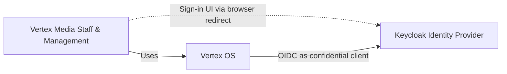
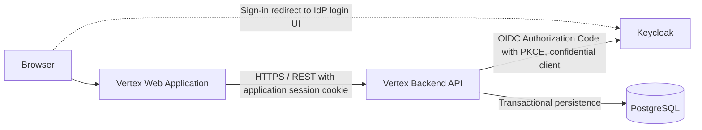
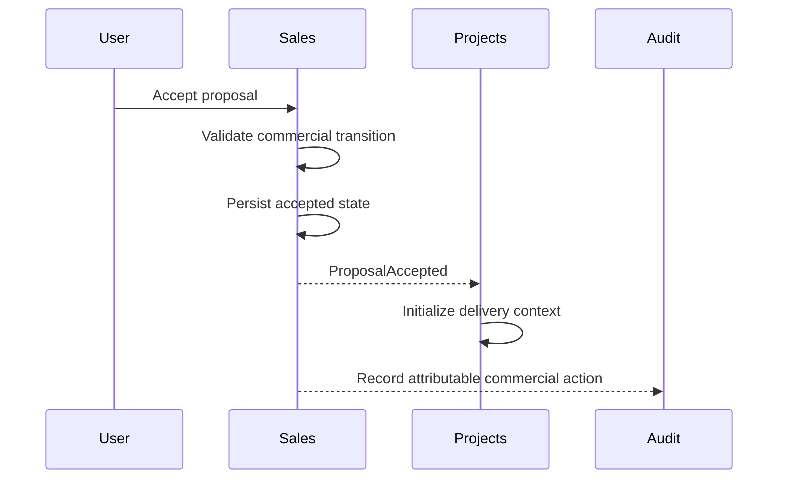
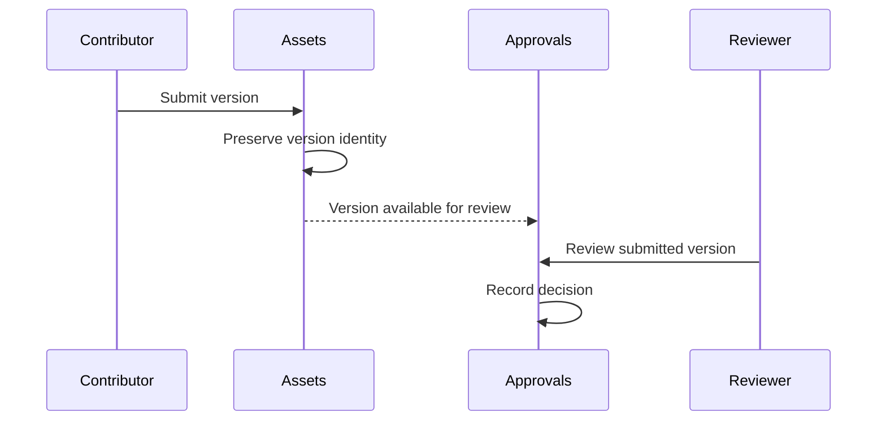
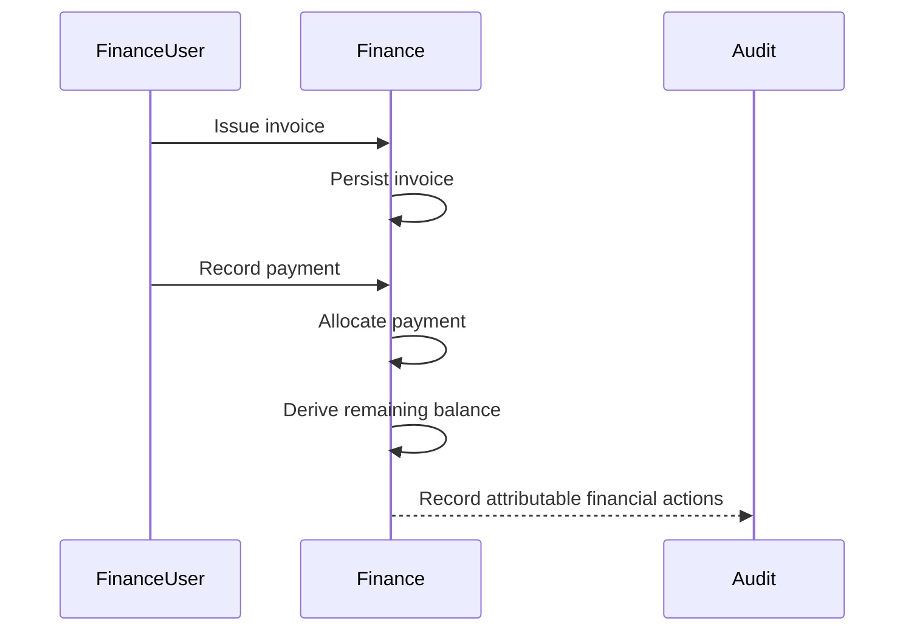
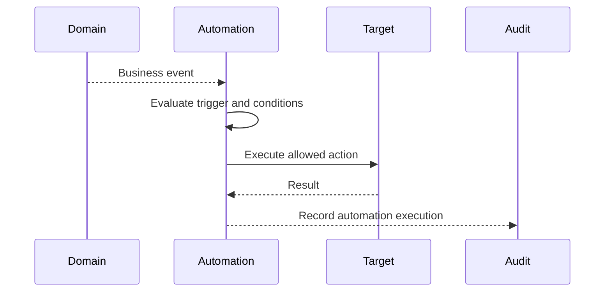

# Vertex OS — Architecture

**Status:** V1 Architecture Baseline
**Scope:** Vertex OS
**Product Source of Truth:** `docs/PRODUCT.md`

---

## 1. Document Role

This document is the canonical description of the current Vertex OS software architecture.

It defines:

* system boundaries,
* top-level software building blocks,
* architectural dependency rules,
* domain isolation,
* data ownership,
* interaction models,
* transaction and consistency boundaries,
* cross-cutting architectural concepts,
* development and deployment assumptions,
* and architecture-level constraints.

This document describes **how Vertex OS is structurally organized**.

It does not define:

* product scope or product requirements,
* detailed business-module behavior,
* database tables or ORM models,
* individual API endpoints,
* exact permission matrices,
* UI component specifications,
* coding-style conventions,
* detailed test strategy,
* implementation task order,
* or the historical rationale of major decisions.

Those concerns belong to their respective product, module, security, UI, engineering, testing, planning, and ADR documents.

Decision rationale and historical alternatives SHOULD be recorded in Architecture Decision Records under `docs/adr/`.

---

## 2. Architecture at a Glance

Vertex OS is a **modular monolith** implemented as a TypeScript monorepo.

The architecture is organized around explicit business-domain boundaries.

The system consists primarily of:

* a browser-based web application,
* a backend application,
* business-domain modules,
* a relational database,
* an external identity provider,
* and supporting runtime components introduced only when a demonstrated requirement justifies them.

Primary architecture characteristics:

* Modular monolith.
* Single repository.
* Explicit business-domain ownership.
* Backend-authoritative business rules.
* PostgreSQL as the primary transactional data store.
* Domain-owned persistence.
* Explicit cross-domain interfaces.
* Controlled use of application and domain events.
* Durable workflow orchestration only where genuinely required.
* Custom Vertex UI system.
* Local-first development.
* Production deployment designed independently for the Vertex Media Contabo environment.
* No premature microservices.
* No unnecessary infrastructure.

The architecture MUST favor operational correctness, maintainability, traceability, and security over speculative scale or architectural novelty.

---

## 3. Architecture Drivers and Quality Goals

Architecture decisions are primarily driven by the following quality goals.

### AQ-01 — Maintainability

Changes within one business domain SHOULD remain localized whenever the business change does not inherently require changes in other domains.

Domain boundaries MUST reduce accidental coupling rather than merely organize folders.

### AQ-02 — Business Correctness

Authoritative business rules MUST be enforced in trusted backend execution paths.

Critical state transitions MUST preserve domain invariants even when multiple clients, interfaces, or automation paths invoke them.

### AQ-03 — Data Integrity

Business-critical data MUST remain internally consistent across successful transactions.

Partial persistence of logically atomic operations MUST be prevented where such partial state would violate domain invariants.

### AQ-04 — Security

Authentication, authorization, input validation, and trust boundaries MUST be explicit architectural concerns.

Security MUST NOT rely exclusively on frontend behavior.

### AQ-05 — Auditability and Traceability

Important commercial, financial, approval, administrative, automated, and security-sensitive actions MUST remain attributable where required by the product.

### AQ-06 — Operational Reliability

Expected runtime failures, retries, concurrent requests, and interrupted long-running operations MUST be handled deliberately rather than left to incidental behavior.

### AQ-07 — Evolvability

The architecture SHOULD allow major domains to evolve independently inside the monolith and SHOULD avoid unnecessary coupling that would make future extraction prohibitively difficult.

Future extraction capability does not justify building distributed services prematurely.

### AQ-08 — Simplicity

The simplest architecture that satisfies current business requirements SHOULD be preferred.

Infrastructure, abstraction, indirection, and asynchronous processing require a concrete justification.

---

## 4. Architectural Constraints

The following constraints apply unless superseded by an accepted ADR.

### AC-01

TypeScript is the primary implementation language.

### AC-02

Vertex OS uses a pnpm workspace managed with Nx.

### AC-03

The backend is built with NestJS using Fastify as the HTTP platform.

### AC-04

The primary API style is REST with an OpenAPI-described external contract.

### AC-05

PostgreSQL is the primary transactional database.

### AC-06

Prisma is the primary ORM and migration mechanism.

The V1 foundation targets **Prisma ORM 7.x**. Adopting a different major version is an architecture-significant change that requires an explicit decision; it MUST NOT happen implicitly through scaffolding defaults or dependency updates.

### AC-07

The browser application uses React and Vite.

### AC-08

The frontend uses TanStack Router for application routing.

### AC-09

The frontend uses TanStack Query for server-state synchronization.

### AC-10

Complex data tables use TanStack Table where appropriate.

### AC-11

The frontend uses the custom Vertex UI design system.

shadcn MUST NOT be introduced.

### AC-12

Tailwind CSS is the styling foundation for Vertex UI.

### AC-13

Authentication is delegated to Keycloak through OpenID Connect.

The Vertex OS backend integrates with Keycloak as a confidential OIDC client using the Authorization Code Flow with PKCE and acts as the browser-facing backend-for-frontend (BFF). The browser holds only an opaque, `Secure`, `HttpOnly` application session cookie issued by the backend; identity-provider tokens never reach browser application code.

Responsibilities are defined in Section 22.

### AC-14

Development is local-first.

Production infrastructure MUST NOT be assumed to exist during initial development.

### AC-15

Production is expected to run in an environment controlled by Vertex Media on Contabo.

The detailed production topology is not defined by this document yet.

### AC-16

S3-compatible storage or cloud object-storage infrastructure MUST NOT be assumed or introduced merely for future convenience.

### AC-17

Microservices are outside the V1 architecture baseline.

### AC-18

Kubernetes is outside the V1 architecture baseline.

---

## 5. System Context

Vertex OS is primarily an internal system used by authorized Vertex Media staff and management.

At the current architecture baseline, the system context is intentionally small.



External integrations MUST NOT be represented as active architecture until they are actually approved and introduced.

Future integrations may include communication, publishing, financial, website, or other external systems, but such possibilities do not make them part of the current architecture.

---

## 6. Solution Strategy

### 6.1 Modular Monolith

Vertex OS uses a modular monolith.

The system is deployed as a small number of runtime applications while preserving strong logical boundaries between business domains.

This provides:

* simpler deployment,
* simpler local development,
* easier transactional consistency,
* lower operational overhead,
* and clear business modularity.

The modular monolith MUST NOT degrade into an unrestricted codebase where any module imports or mutates any other module's internals.

### 6.2 Domain-Oriented Decomposition

The primary decomposition axis is business responsibility rather than technical layer alone.

Major domains include:

* IAM,
* CRM,
* Services,
* Sales,
* Projects,
* Tasks,
* Briefs,
* Assets,
* Approvals,
* Content,
* Time,
* Finance,
* Collaboration,
* Notifications,
* Automation,
* Reporting,
* Audit.

Detailed domain responsibilities belong to `docs/MODULES.md`.

### 6.3 Backend-Authoritative Business Rules

Authoritative business behavior belongs to backend domain/application logic.

The frontend MAY provide immediate validation and usability constraints, but frontend logic MUST NOT be the sole enforcement mechanism for:

* permissions,
* financial correctness,
* lifecycle transitions,
* approval rules,
* domain invariants,
* or transactional integrity.

### 6.4 Explicit Interfaces

Domains collaborate through explicit interfaces.

A domain's internal persistence, repositories, internal services, and implementation types are not public APIs merely because they exist inside the same process.

### 6.5 Controlled Asynchrony

Asynchronous processing is introduced only when it provides a concrete benefit such as:

* decoupled reactions,
* retriable background execution,
* durable long-running workflows,
* or isolation of non-critical follow-up work.

Synchronous in-process calls remain preferred when an immediate response is required and asynchronous complexity provides no meaningful advantage.

### 6.6 Local-First Infrastructure

Development infrastructure should remain minimal and reproducible.

Production-specific complexity is postponed until production requirements are known.

---

## 7. System and Container View

The initial runtime architecture is intentionally compact.



The browser is redirected to Keycloak only for the sign-in user interface. The backend exchanges the authorization code for tokens, keeps them server-side, and issues its own application session to the browser.

Additional runtime components MUST have a documented reason for existence.

Examples of components that MAY be introduced later when justified include:

* background workers,
* Temporal workers,
* cache services,
* scheduled-job runners,
* local or production file persistence services,
* dedicated search infrastructure.

Their possible future usefulness is not sufficient justification for adding them now.

---

## 8. Repository-Level Building Blocks

The expected repository architecture is conceptually:

```text
vertex-os/
├── apps/
│   ├── api/
│   └── web/
│
├── packages/
│   ├── ui/
│   ├── contracts/
│   ├── database/
│   ├── shared/
│   ├── config/
│   ├── testing/
│   └── api-client/
│
├── domains/
│   ├── iam/
│   ├── crm/
│   ├── services/
│   ├── sales/
│   ├── projects/
│   ├── tasks/
│   ├── briefs/
│   ├── assets/
│   ├── approvals/
│   ├── content/
│   ├── time/
│   ├── finance/
│   ├── collaboration/
│   ├── notifications/
│   ├── automation/
│   ├── reporting/
│   └── audit/
│
└── docs/
```

This structure is an architectural direction, not permission to create every directory before it is needed.

The repository SHOULD grow incrementally.

Empty abstractions or placeholder packages MUST NOT be created solely to make the tree match documentation.

---

## 9. Modular Architecture and Dependency Rules

The modular architecture is governed by explicit dependency rules.

### AR-001 — Modular Monolith

Vertex OS MUST remain deployable as a modular monolith unless an accepted ADR explicitly changes the architecture.

### AR-002 — Domain Ownership

Every business capability MUST have a clear owning domain.

### AR-003 — Explicit Public Interfaces

A domain MUST expose an explicit public application interface for functionality intended to be used outside the domain.

### AR-004 — No Deep Imports Across Domains

One domain MUST NOT depend on another domain's internal files, repositories, persistence adapters, private services, or internal implementation types.

### AR-005 — No Cross-Domain Persistence Shortcuts

A domain MUST NOT use another domain's persistence model or database tables as its application API.

### AR-006 — No Circular Domain Dependencies

Circular compile-time dependencies between business domains MUST be avoided.

If a workflow appears to require a circular dependency, the interaction model MUST be redesigned rather than hidden with dependency-injection tricks.

### AR-007 — Shared Code Must Be Truly Shared

The shared layer MUST contain only cross-cutting, domain-neutral capabilities.

Business concepts MUST NOT be moved into `shared` merely to bypass domain boundaries.

### AR-008 — Apps Compose; Domains Own Business Logic

Runtime applications MAY compose domains and infrastructure.

Application entrypoints MUST NOT become the primary location of business logic.

### AR-009 — Backend Authority

Authoritative business invariants MUST be enforced on the backend.

### AR-010 — UI Isolation

Frontend packages MUST NOT depend directly on backend persistence or database implementation.

### AR-011 — Database Isolation

Database access MUST occur through backend-owned infrastructure.

### AR-012 — Explicit Cross-Domain Interaction

Cross-domain interactions MUST use one of the recognized interaction styles defined in this document.

### AR-013 — No Premature Distribution

Domain separation MUST NOT be implemented as network distribution without a concrete operational requirement and accepted ADR.

### AR-014 — No Infrastructure-Driven Domain Design

Business-domain boundaries MUST NOT be determined merely by framework, database, queue, or deployment concerns.

---

## 10. Internal Domain Structure

Detailed internal organization may evolve, but each domain SHOULD conceptually separate concerns such as:

```text
domain/
├── domain/
├── application/
├── infrastructure/
└── interface/
```

These names are conceptual rather than mandatory folder names.

### Domain Layer

Owns:

* business concepts,
* business invariants,
* domain policies,
* value objects,
* and domain behavior.

It SHOULD avoid framework-specific dependencies where practical.

### Application Layer

Owns:

* use cases,
* orchestration within the domain,
* transaction coordination,
* authorization-aware application operations,
* and public application contracts.

### Infrastructure Layer

Owns implementation concerns such as:

* persistence,
* ORM integration,
* external systems,
* framework adapters,
* background execution adapters,
* and technical implementations of interfaces.

### Interface Layer

Owns inbound delivery mechanisms such as:

* HTTP controllers,
* request mapping,
* response mapping,
* and transport-specific concerns.

The exact package layout SHOULD be validated during implementation rather than treated as immutable architecture.

The separation of responsibilities is more important than directory names.

---

## 11. Domain Public Surface

A domain's externally consumable surface SHOULD remain intentionally small.

Other domains may depend on:

* explicitly exported application commands,
* explicitly exported application queries,
* explicitly exported contract types,
* domain/application events intended for external consumption.

Other domains MUST NOT depend on:

* internal repositories,
* Prisma-specific models,
* private service classes,
* internal entities not declared public,
* internal mapping logic,
* or implementation-specific database structures.

The public surface SHOULD expose business capabilities rather than persistence mechanics.

---

## 12. Data Ownership

PostgreSQL is the shared physical database platform.

A shared physical database does **not** imply shared logical ownership.

### AR-015 — Domain-Owned Data

Every business data model MUST have a clear owning domain.

### AR-016 — Ownership Is Logical

A domain retains ownership of its data even when multiple domains share one PostgreSQL instance.

### AR-017 — Reads Do Not Grant Ownership

A reporting or read requirement does not give another domain authority to mutate the owning domain's data.

### AR-018 — Writes Follow Ownership

State changes MUST pass through the owning domain's authoritative application behavior.

### AR-019 — Schema Proximity Is Not an API

Physical proximity inside the same database MUST NOT be treated as permission for arbitrary cross-domain queries and writes.

### Cross-Domain Read Models

Cross-domain reporting and dashboards MAY use purpose-built read models, projections, reporting queries, or other explicitly designed mechanisms.

Such mechanisms MUST NOT become an alternative write path into domain-owned state.

---

## 13. Transactions and Consistency

Transaction boundaries MUST follow business consistency requirements.

### AR-020 — Atomic Business Operations

Operations whose partial completion would violate a domain invariant MUST execute atomically.

### AR-021 — Domain Transaction Ownership

A domain application operation SHOULD own the transaction required to maintain its invariants.

### AR-022 — Cross-Domain Transactions

Cross-domain atomic transactions MAY be used inside the modular monolith when the business invariant genuinely requires immediate consistency and the design remains explicit.

They SHOULD NOT become the default integration mechanism between all domains.

When such a transaction is required, an application-level use case MAY establish the transaction context, but each owning domain MUST still be invoked through its public application capability.

Infrastructure-specific transaction objects MUST NOT appear in domain public interfaces or become a mechanism for bypassing domain ownership.

No general transaction-orchestration framework is part of the baseline; the concrete mechanism is decided when the first genuine cross-domain case is implemented.

### AR-023 — Event Publication Safety

When an event represents a successfully committed business state, the architecture MUST prevent consumers from acting on an event for state that ultimately did not commit.

The exact implementation mechanism is an implementation decision and MAY evolve.

### Eventual Consistency

Eventual consistency MAY be used for:

* notifications,
* non-critical activity projections,
* reporting projections,
* automation follow-up,
* search indexing,
* and similar derived behavior.

It SHOULD NOT be used where the product requires immediate invariant preservation.

---

## 14. Interaction Model

Vertex OS recognizes several interaction styles.

### 14.1 Direct Application Call

Use when:

* the caller needs an immediate result,
* the dependency is explicit and acceptable,
* the operation is local to the process,
* and asynchronous decoupling provides no meaningful benefit.

Conceptually:

```text
Domain A
   │
   ▼
Public Application Interface
   │
   ▼
Domain B
```

### 14.2 Application or Domain Event

Use when:

* an event has already occurred,
* one or more independent consumers may react,
* the originating operation should not require detailed knowledge of each reaction,
* and immediate synchronous coupling is unnecessary.

Example concept:

```text
Proposal Accepted
        │
        ├── Project reaction
        ├── Notification reaction
        ├── Audit reaction
        └── Activity projection
```

An event describes something that happened.

It MUST NOT be used as a disguised remote command merely to make dependencies appear looser.

### 14.3 Background Job

Use when work:

* does not need to delay the user request,
* can be retried safely,
* is bounded,
* and does not require durable long-running orchestration.

### 14.4 Durable Workflow

Temporal MAY be used when a business or technical process genuinely requires:

* long-running execution,
* durable waiting,
* retries across process restarts,
* multi-step orchestration,
* timers,
* compensation,
* or reliable continuation after failure.

Temporal MUST NOT be used for ordinary request/response use cases or simple background work merely because it is available.

### AR-024 — Choose the Simplest Interaction Model

Cross-domain collaboration MUST use the simplest interaction model that satisfies the required consistency, reliability, and coupling characteristics.

---

## 15. Runtime Scenario — Proposal Acceptance

A representative commercial-to-delivery interaction may conceptually follow:



The exact implementation MAY use synchronous or event-assisted behavior depending on the final consistency requirements defined in module specifications.

The important architectural properties are:

* Sales owns proposal acceptance.
* Projects does not mutate Sales persistence directly.
* acceptance remains attributable.
* project creation remains traceable to the accepted commercial commitment.

---

## 16. Runtime Scenario — Review and Approval



Architecture MUST preserve the identity of the reviewed version.

A later revision MUST NOT retroactively change the subject of an earlier approval.

---

## 17. Runtime Scenario — Invoice and Payment



Invoice value, payment value, allocation, and outstanding balance are separate concepts.

A payment MUST NOT silently rewrite the original invoice amount.

Outstanding balance is derived from the authoritative financial records. A stored or materialized balance is a read projection of those records, never an independently written source of truth; ownership detail belongs to `docs/MODULES.md`.

---

## 18. Runtime Scenario — Controlled Automation



Automation execution MUST remain attributable to the automation process and MUST NOT become indistinguishable from a direct human action where attribution matters.

---

## 19. API Architecture

REST is the primary application API style.

The API layer is a delivery mechanism and MUST NOT become the source of business truth.

### AR-025 — Stable Contracts

External API contracts SHOULD remain explicit and versionable where compatibility matters.

### AR-026 — Validation at Trust Boundaries

Untrusted external input MUST be validated before entering authoritative application behavior.

### AR-027 — Transport Independence

Core business logic SHOULD NOT depend directly on HTTP request or response objects.

### AR-028 — API Does Not Define Domain Ownership

The existence of an endpoint does not determine which domain owns the underlying business concept.

### OpenAPI

OpenAPI SHOULD describe the externally supported REST surface.

Generated clients or types MAY be used where they reduce contract drift.

---

## 20. Frontend Architecture

The web application is an operational client of backend capabilities.

It is not an alternative business-rule engine.

The frontend SHOULD be organized primarily around user-facing features and shared platform capabilities.

Conceptually:

```text
apps/web/
├── app/
├── features/
├── layouts/
├── components/
└── lib/
```

Exact organization MAY evolve.

### AR-029 — Server State

Authoritative server state SHOULD be managed through a consistent server-state layer.

### AR-030 — No Database Semantics in UI

Frontend code MUST NOT depend on database schema details.

### AR-031 — No Authoritative Business Rules in Components

React components MUST NOT become the sole enforcement point for business invariants.

### AR-032 — Shared UI System

Reusable interface primitives SHOULD be provided by the custom Vertex UI system rather than repeatedly reimplemented by feature code.

### AR-033 — UI Domain Independence

Vertex UI MUST remain business-domain neutral unless a component is intentionally defined as a higher-level product pattern.

---

## 21. Vertex UI Architecture

Vertex OS uses a custom in-house design system and component library.

The UI system is responsible for shared interface foundations such as:

* design tokens,
* typography,
* spacing,
* surfaces,
* controls,
* overlays,
* accessibility behavior,
* interaction states,
* layout primitives,
* and reusable application patterns.

Detailed UI-system rules belong to dedicated Vertex UI documentation.

`shadcn` MUST NOT be introduced.

Third-party low-level primitives MAY be considered when they provide a meaningful accessibility or interaction benefit, but their use MUST NOT replace the Vertex UI identity or create competing component systems.

---

## 22. Identity and Authentication Boundary

Authentication uses one topology:

```text
Browser / React
        |
        | Secure + HttpOnly application session cookie
        v
Vertex OS API / BFF
        |
        | OIDC Authorization Code Flow + PKCE
        | confidential client
        v
Keycloak
```

Keycloak owns identity-provider concerns:

* primary identity and user credentials,
* password hashing, credential storage, and password policy,
* MFA credential factors,
* identity-provider credential recovery,
* the IdP/SSO authentication session,
* OIDC/OAuth2 token issuance and authentication-protocol behavior.

The Vertex OS backend, acting as BFF, owns:

* the browser-facing application session and its opaque session cookie,
* the server-side association between the application session and OIDC state/tokens,
* CSRF protection for cookie-authenticated application requests,
* application logout and session termination,
* mapping the authenticated identity into the Vertex OS application context.

Vertex IAM owns application-specific access concepts:

* the application user record and its mapping to the identity-provider identity,
* organizational membership and department relationships,
* application roles, permissions, and scopes/capabilities where applicable,
* application account/access state,
* application-level authorization primitives.

Business domains own resource-level and domain-specific authorization decisions.

### AR-034 — Authentication Is Not Authorization

Successful authentication MUST NOT imply unrestricted application access.

Identity-provider authentication establishes identity only. Access additionally requires an active Vertex application user mapped to that identity, and every business operation requires Vertex authorization.

### AR-035 — Application Authorization

Vertex OS MUST enforce business authorization independently of client-side interface visibility.

### AR-036 — External Identity References

Application data MAY reference external identity identifiers, but business-domain models SHOULD NOT become coupled to Keycloak's internal persistence model.

### AR-041 — Backend-Owned Application Session

The browser authenticates to Vertex OS only through the backend-issued application session.

Identity-provider tokens are held server-side and MUST NOT be delivered to, stored by, or handled in browser application code.

Detailed authentication, session, credential, and authorization security requirements belong to `docs/SECURITY.md`; IAM ownership belongs to `docs/MODULES.md`.

---

## 23. Authorization Architecture

Authorization is a cross-cutting concern.

Permission checks SHOULD occur at authoritative application boundaries close enough to business behavior to prevent bypass through alternative interfaces.

The architecture MUST support permission-oriented authorization rather than relying only on broad role names.

Roles MAY aggregate permissions.

Business domains MAY define domain-specific authorization requirements.

Frontend visibility rules improve usability but MUST NOT substitute for backend authorization.

---

## 24. Validation Architecture

Validation occurs at multiple semantic levels.

### Input Validation

Ensures external data has acceptable shape and basic constraints.

### Application Validation

Ensures the requested operation is meaningful in its operational context.

### Domain Validation

Protects business invariants.

These levels SHOULD NOT be collapsed into one generic validation layer.

A syntactically valid request may still be an invalid business operation.

---

## 25. Error Architecture

Errors SHOULD distinguish relevant categories such as:

* invalid input,
* unauthorized operation,
* forbidden operation,
* missing resource,
* business-rule violation,
* conflict,
* concurrency issue,
* dependency failure,
* and unexpected internal failure.

Internal implementation details MUST NOT be exposed unnecessarily to clients.

Expected business failures SHOULD be represented deliberately rather than converted into generic server failures.

Detailed error conventions belong to `docs/ENGINEERING.md`.

---

## 26. Audit vs. Activity

Audit history and operational activity are distinct concepts.

### Audit

Answers questions such as:

* who changed a protected setting,
* who approved a commercial action,
* who recorded a payment,
* what sensitive value changed,
* and when the action occurred.

Audit records are designed primarily for accountability and investigation.

### Activity

Answers questions such as:

* what happened on this project,
* who commented,
* who completed a task,
* what milestone changed,
* and what recent operational events are relevant to users.

Activity feeds are designed primarily for operational awareness.

A user-facing activity feed MUST NOT be treated as a substitute for required audit history.

Activity ownership follows domain ownership: the module that owns a business fact is authoritative for the corresponding activity fact. Cross-module activity timelines are read projections assembled from those facts (see Section 12, Cross-Domain Read Models); no dedicated Activity module is part of the baseline.

Audit MUST NOT be used as the source of activity feeds or as a general event store. Detailed ownership belongs to `docs/MODULES.md`.

---

## 27. Money Architecture

Financial correctness is an architectural concern.

### AR-037 — No Binary Floating Point for Authoritative Money

Authoritative monetary calculations MUST NOT rely on binary floating-point arithmetic.

### AR-038 — Explicit Currency

Monetary values MUST retain their applicable currency context.

### AR-039 — Explicit Rounding

Rounding behavior MUST be deliberate and consistent with the relevant financial operation.

### AR-040 — Distinct Financial Concepts

Quoted amount, invoiced amount, payment amount, allocated amount, expense amount, and outstanding balance MUST remain distinct concepts.

Detailed financial rules belong to the Finance module specification.

---

## 28. Time Architecture

Time handling MUST be explicit.

The architecture MUST distinguish concepts such as:

* timestamp,
* local date,
* due date,
* business date,
* and timezone-aware date/time.

UTC SHOULD be used for persisted absolute instants unless a domain-specific requirement requires another representation.

A local business date MUST NOT be inferred carelessly from a UTC timestamp when timezone affects business meaning.

The exact time-handling conventions belong to `docs/ENGINEERING.md`.

---

## 29. Files and Assets Architecture

Assets are product-level concepts.

The architecture MUST distinguish:

* asset metadata,
* business relationships,
* version identity,
* and physical file persistence.

The Assets domain SHOULD own product-level asset metadata and version relationships.

Physical file persistence MUST be hidden behind an explicit infrastructure boundary so that local development and future production storage choices do not leak into domain behavior.

No S3-compatible implementation is assumed by the current baseline.

The initial implementation SHOULD use the simplest safe local persistence strategy that satisfies development requirements.

Production file persistence for the Contabo environment remains an explicit future architecture decision.

---

## 30. Background Processing

Background execution MAY be introduced for work that should not block interactive requests.

Examples MAY include:

* generating derived files,
* notifications,
* report preparation,
* non-critical projections,
* or integration work.

Background execution MUST have defined retry, failure, and observability behavior appropriate to its importance.

A background job system MUST NOT be introduced before a concrete use case requires it.

---

## 31. Caching

The database and owning domain remain authoritative unless explicitly documented otherwise.

Caching MAY be introduced when measurement demonstrates a real performance or load requirement.

Cache invalidation semantics MUST be understood before introducing a cache.

Redis MUST NOT be added solely because it is commonly used in similar systems.

The need for Redis is evaluated from actual use cases.

---

## 32. Search

Initial search SHOULD use the simplest solution capable of satisfying product requirements.

PostgreSQL-based search MAY serve initial needs.

Dedicated search infrastructure SHOULD NOT be introduced until requirements such as scale, relevance, latency, typo tolerance, or cross-domain indexing justify it.

Search indexes, when introduced, are derived representations and MUST NOT become authoritative business storage.

---

## 33. Observability

Observability is a cross-cutting architectural capability.

The system SHOULD support:

* structured logs,
* request correlation,
* trace context,
* meaningful metrics,
* and actionable failure information.

OpenTelemetry is the preferred observability standard.

Observability MUST avoid leaking credentials, tokens, or sensitive business data.

Critical workflows SHOULD be diagnosable without requiring speculative reconstruction from incomplete logs.

Detailed conventions belong to engineering and operations documentation.

---

## 34. Idempotency

Idempotency MUST be designed where duplicate execution could create harmful business effects.

Candidate operations include:

* financial writes,
* externally retried requests,
* automation actions,
* integration callbacks,
* or durable workflow activities.

Not every request requires idempotency infrastructure.

The requirement SHOULD be determined from the business consequence of duplicate execution.

---

## 35. Concurrency

Concurrent writes MUST be considered where two valid requests may attempt incompatible state changes.

Concurrency protection MAY use mechanisms such as:

* transactional checks,
* optimistic concurrency,
* database constraints,
* locking,
* or other deliberate techniques.

The mechanism depends on domain requirements.

Last-write-wins behavior MUST NOT be accepted implicitly for business-sensitive state.

---

## 36. Development Architecture

Development is local-first.

The local environment SHOULD be:

* reproducible,
* understandable,
* fast enough for normal iteration,
* and free from unnecessary production-only infrastructure.

The repository SHOULD provide a consistent way to run required local dependencies once Phase 0 establishes the actual implementation.

Development environment documentation MUST reflect commands and services that actually exist.

No infrastructure should be documented as required before it exists.

---

## 37. Production Deployment Direction

The production target is an environment controlled by Vertex Media on Contabo.

Detailed production architecture is intentionally deferred until requirements are known.

The future design will need to address:

* process supervision,
* database persistence,
* file persistence,
* HTTPS termination,
* backups,
* secrets,
* monitoring,
* recovery,
* and deployment automation.

This document MUST NOT invent those choices prematurely.

When production topology is defined, a dedicated deployment document MAY become the authoritative source.

---

## 38. Architecture Enforcement

Architecture rules SHOULD be enforced automatically wherever practical.

Prose explains architecture.

Tooling should prevent obvious violations.

Expected enforcement mechanisms may include:

| Concern                        | Expected Enforcement             |
| ------------------------------ | -------------------------------- |
| Package dependency direction   | Nx project boundaries            |
| Forbidden cross-domain imports | Nx / ESLint rules                |
| Type correctness               | TypeScript                       |
| API contract validation        | Schema validation + tests        |
| Database schema integrity      | Prisma validation and migrations |
| Domain invariants              | Unit/integration tests           |
| Public behavior                | Integration/E2E tests            |
| Formatting                     | Automated formatter              |
| Lint rules                     | ESLint                           |
| Build integrity                | CI                               |
| Architecture exceptions        | Review + ADR                     |

Rules that can be turned into deterministic checks SHOULD not rely solely on agent memory.

---

## 39. Architecture Fitness Functions

The project SHOULD gradually encode important architectural rules as automated checks.

Examples:

### AF-01

Frontend code must not import database infrastructure.

### AF-02

A business domain must not deep-import another domain's private implementation.

### AF-03

Shared packages must not depend on business domains.

### AF-04

Domain dependency cycles must fail validation.

### AF-05

Production builds must pass type checking.

### AF-06

Database migrations must pass repository-defined validation before acceptance.

### AF-07

Public contracts and implementation must remain synchronized.

Fitness functions SHOULD be added as the repository becomes capable of enforcing them.

Do not create placeholder enforcement scripts that do not genuinely validate the rule.

---

## 40. Architectural Decisions

Major decisions SHOULD be recorded as ADRs.

Expected foundational ADRs include:

* `ADR-0001` — Modular Monolith.
* `ADR-0002` — PostgreSQL as Primary Transactional Store.
* `ADR-0003` — NestJS + Fastify Backend Platform.
* `ADR-0004` — Keycloak OIDC Authentication with Backend-Owned Application Sessions (BFF).
* `ADR-0005` — Custom Vertex UI System.
* `ADR-0006` — Local-First Development.
* `ADR-0007` — REST + OpenAPI External API.
* `ADR-0008` — Domain-Owned Data in a Shared PostgreSQL Platform.
* `ADR-0009` — Controlled Event-Driven Collaboration.
* `ADR-0010` — Temporal Adoption Criteria.

An expected ADR name in this document does not mean the ADR has already been written or accepted.

Only actual ADR files with accepted status are authoritative decision records.

---

## 41. Open Architectural Questions

Only architecture-significant unresolved questions belong here.

### OPEN-001 — Production File Persistence

The production strategy for durable file storage on the Contabo environment has not yet been selected.

No S3-compatible assumption is currently accepted.

### OPEN-002 — Temporal Adoption Point

Temporal is an approved architectural direction for genuinely durable long-running workflows, but exact V1 workflows requiring it must be validated during module design.

### OPEN-003 — Background Job Infrastructure

No general-purpose background queue or worker infrastructure is assumed until concrete workloads require it.

### OPEN-004 — Cache Infrastructure

Redis or another cache service is not currently required by the baseline.

Its introduction requires a demonstrated use case.

### OPEN-005 — Production Topology

The exact Contabo deployment topology will be designed after the application foundation and operational requirements are clearer.

---

## 42. Architecture Change Discipline

A change is architecture-significant when it materially changes any of the following:

* system topology,
* deployment model,
* primary technology,
* business-domain boundary,
* domain dependency direction,
* authoritative data ownership,
* transaction semantics,
* external identity boundary,
* cross-domain interaction model,
* public API compatibility strategy,
* persistence architecture,
* security boundary,
* or major infrastructure dependency.

Architecture-significant changes SHOULD be supported by an ADR before implementation when practical.

Routine implementation detail MUST NOT be promoted into an ADR merely because a choice exists.

---

## 43. Documentation Ownership

This document owns system-level structural architecture.

Related sources of truth:

* `AGENTS.md` — repository-wide agent operating rules.
* `docs/PRODUCT.md` — product purpose, scope, requirements, and product invariants.
* `docs/MODULES.md` — detailed business-domain ownership and module contracts.
* `docs/ENGINEERING.md` — implementation and coding conventions.
* `docs/SECURITY.md` — security and authorization architecture in depth.
* `docs/TESTING.md` — verification strategy.
* `docs/PLANS.md` — execution planning for substantial changes (canonical once created).
* `docs/adr/` — architecture decision history and rationale (canonical once accepted records exist).

Do not duplicate detailed content owned by those documents.

When another document needs an architecture-level rule, it SHOULD reference the authoritative rule here rather than restating it with slightly different wording.

---

## 44. Architecture Summary Rules

The following rules summarize the architectural baseline:

1. Keep Vertex OS a modular monolith.
2. Organize around business domains.
3. Give every important business concept a clear owner.
4. Do not use another domain's database model as an API.
5. Expose explicit public application interfaces.
6. Keep business rules authoritative on the backend.
7. Use synchronous calls when they are the simplest correct model.
8. Use events for independent reactions, not to hide dependencies.
9. Use durable workflows only for genuinely durable orchestration.
10. Keep the shared layer business-neutral.
11. Treat PostgreSQL as one physical platform with logical domain ownership.
12. Preserve transactional integrity where business invariants require it.
13. Keep authentication and authorization conceptually separate.
14. Preserve auditability for significant actions.
15. Keep financial concepts explicit and precise.
16. Handle time and timezone semantics deliberately.
17. Hide physical file persistence behind an infrastructure boundary.
18. Add caches, queues, search systems, and other infrastructure only when justified.
19. Enforce architecture rules with tooling where practical.
20. Prefer simple, explicit architecture over speculative flexibility.

This document describes the current accepted architecture.

It should evolve when the architecture evolves, while rationale and historical alternatives remain in ADRs.
