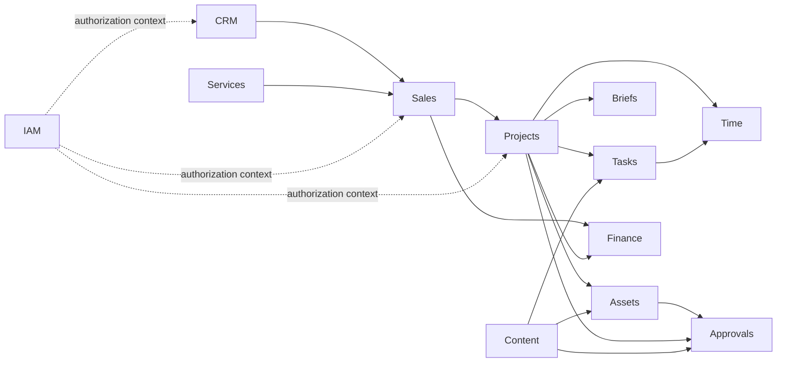
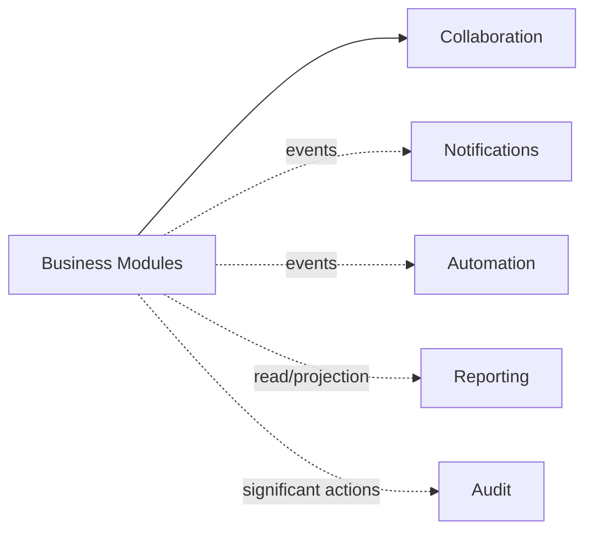

# Vertex OS — Module Map

**Status:** V1 Domain Baseline
**Scope:** Vertex OS V1
**Product Source:** `docs/PRODUCT.md`
**Architecture Source:** `docs/ARCHITECTURE.md`

---

## 1. Document Role

This document is the canonical strategic module map of Vertex OS.

It defines:

* business and platform module boundaries,
* authoritative ownership of major business concepts,
* high-level responsibilities,
* explicit non-responsibilities,
* allowed cross-module relationships,
* public collaboration expectations,
* and rules for evolving module boundaries.

This document answers:

> **Which module owns which business responsibility, and how may modules collaborate without violating those boundaries?**

It does not define:

* database schemas,
* ORM models,
* detailed aggregates,
* every command or query,
* complete event schemas,
* HTTP endpoints,
* permission matrices,
* detailed state machines,
* UI screens,
* or implementation classes.

Those details belong to module-specific specifications and implementation artifacts.

The module map describes intended V1 ownership.

A module appearing in this document does not imply that its implementation already exists.

---

## 2. Module Model

A Vertex OS module is an explicit ownership boundary around a coherent business or platform responsibility.

A business module owns:

* its canonical business vocabulary,
* authoritative state for its concepts,
* business invariants,
* valid state transitions,
* mutation authority,
* and public application capabilities.

A platform module owns a cross-cutting capability with its own behavior and state while remaining neutral about the business decisions of the domains it supports.

Physical code proximity does not imply shared ownership.

A module may reference another module's identifiers or consume its published information without gaining authority over the referenced concept.

### Ownership

When this document states:

> `CRM owns Client`

it means CRM is authoritative for the canonical client identity and lifecycle information assigned to CRM.

It does not mean other modules cannot retain:

* `clientId`,
* approved snapshots,
* denormalized display information,
* or derived read data,

when their own domain requirements require them.

Those copies MUST NOT become competing authorities.

---

## 3. Domain Classification

Vertex OS modules are grouped conceptually into three categories.

The classification aids understanding only.

It does not grant additional dependency permissions.

### 3.1 Organizational and Access

* IAM

### 3.2 Business Modules

* CRM
* Services
* Sales
* Projects
* Tasks
* Briefs
* Assets
* Approvals
* Content
* Time
* Finance

### 3.3 Platform and Cross-Cutting Modules

* Collaboration
* Notifications
* Automation
* Reporting
* Audit

---

## 4. Module Boundary Rules

### MR-001 — Single Primary Owner

Every authoritative business concept MUST have one primary owning module.

### MR-002 — Ownership Includes Mutation Authority

The owning module controls authoritative state changes for the concept it owns.

### MR-003 — References Do Not Transfer Ownership

Holding another module's identifier does not grant authority to mutate the referenced concept.

### MR-004 — No Direct Foreign Mutation

A module MUST NOT directly mutate another module's authoritative state through persistence shortcuts.

### MR-005 — Explicit Public Capabilities

Cross-module behavior MUST use an explicitly supported public application capability, contract, or integration event.

### MR-006 — Internal Models Are Private by Default

Repositories, ORM models, private services, internal entities, persistence structures, and internal mappings are not cross-module APIs.

### MR-007 — No Domain Model Dumping Ground

Business concepts MUST NOT be moved into `shared` merely because multiple modules use related information.

### MR-008 — Integration Events Represent Facts

Published integration events SHOULD represent meaningful facts that already occurred.

They SHOULD NOT be disguised commands used merely to hide coupling.

### MR-009 — Platform Modules Do Not Own Originating Business Decisions

Notifications, Automation, Reporting, Collaboration, and Audit MUST NOT take ownership of business decisions belonging to business modules.

### MR-010 — Reporting Is Read-Oriented

Reporting may aggregate or project information across domains but MUST NOT become an alternative write authority.

### MR-011 — Automation Respects Domain APIs

Automation MUST invoke authoritative public capabilities rather than bypassing domains through repositories or tables.

### MR-012 — Notification Ownership Is Delivery Ownership

Notifications owns notification behavior and delivery state, not the originating business event.

### MR-013 — Audit Does Not Own Business State

Audit owns evidence about significant actions, not the business state those actions changed.

### MR-014 — Boundary Changes Require Domain Reasoning

Modules MUST NOT be split or merged solely because of folder size, line count, or implementation convenience.

### MR-015 — Explicit Boundaries Over Hidden Coupling

If two modules genuinely require collaboration, the relationship SHOULD be modeled explicitly rather than hidden behind shared mutable state.

---

## 5. Cross-Module Interaction Types

Vertex OS recognizes four primary forms of cross-module relationship.

### 5.1 Direct Public Capability

A module invokes a supported public application capability of another module when an immediate answer or authoritative operation is required.

```text
Module A
   │
   ▼
Module B Public Application Interface
```

### 5.2 Integration Event

A module publishes a business fact after an important state change.

Independent consumers may react without the publisher knowing their implementation details.

```text
Module A
   │
   └── Event ──► Module B
```

### 5.3 Identifier Reference

A module stores an identifier referring to a concept owned elsewhere.

```text
Project.clientId ──► CRM Client
```

The reference does not transfer ownership.

### 5.4 Read Projection

A read-oriented module or capability consumes authoritative information to produce reporting, search, dashboards, or other derived views.

```text
Business Modules
       │
       ▼
   Reporting
```

A projection MUST NOT become an alternative source for authoritative writes.

---

## 6. High-Level Context Map

The primary V1 business flow is:



Cross-cutting platform relationships are summarized separately:



These diagrams intentionally show only primary relationships.

They are not compile-time dependency graphs.

---

# 7. Organizational and Access Module

## MOD-IAM — Identity, Organization, and Access

**Purpose:**
Represent Vertex OS application users, organizational membership, departments, roles, permissions, and the application-side authorization context required by all protected operations.

**Owns:**

* application user/profile record,
* the mapping between an identity-provider identity and the application user (external identity reference),
* departments,
* organizational membership,
* application roles,
* permissions and scopes/capabilities where applicable,
* role-permission relationships,
* user-role or membership relationships,
* application access state.

User credentials, password policy, authentication factors, credential recovery, and the identity-provider session belong to Keycloak. The browser-facing application session and its cookie belong to the Vertex OS backend acting as BFF; they are platform infrastructure, not IAM domain state. IAM owns which identity-provider identity maps to which application user and whether that user may currently access Vertex OS (`docs/ARCHITECTURE.md`, Section 22).

Whether IAM provisions identity-provider accounts through the identity provider's administrative API or links identities created there is decided in `docs/modules/iam.md`; either way, identity-provider authentication alone MUST NOT grant Vertex OS access.

**Does not own:**

* user credentials, MFA factors, or identity-provider sessions,
* the application session mechanism,
* client contacts,
* project membership as delivery state,
* task assignment,
* approval decisions,
* employee time entries,
* business-domain records.

**Public capabilities include:**

* resolve the application user and access state for an authenticated identity-provider identity,
* determine organizational membership,
* resolve roles and permissions,
* manage authorized application access,
* provide application authorization context.

**Key relationships:**
All protected modules depend conceptually on IAM authorization context, but business modules MUST NOT depend on IAM persistence internals.

**Detailed specification:**
`docs/modules/iam.md`

---

# 8. Business Module Catalog

## MOD-CRM — Customer Relationship Management

**Purpose:**
Own the canonical relationship context for prospects and clients before and throughout their commercial relationship with Vertex Media.

**Owns:**

* Lead,
* Client,
* Contact,
* Opportunity,
* CRM relationship/activity context.

**Does not own:**

* Service,
* Proposal,
* Quotation,
* Contract,
* Project,
* Invoice,
* Payment.

**Public capabilities include:**

* register and manage leads,
* qualify commercial interest,
* establish or update client relationships,
* manage client contacts,
* manage opportunities,
* resolve canonical client/contact context.

**Key relationships:**

* Sales references CRM-owned clients, contacts, and opportunities.
* Projects references CRM-owned clients.
* Finance references CRM-owned clients for financial relationships.

CRM remains authoritative for canonical client relationship state.

**Detailed specification:**
`docs/modules/crm.md`

---

## MOD-SERVICES — Service Catalog

**Purpose:**
Own the canonical definition of professional services Vertex Media offers.

**Owns:**

* Service,
* service classification,
* service availability/state,
* service-level descriptive metadata,
* reusable service definitions.

Service packages, pricing models, deliverable templates, or related concepts may be added when explicitly defined by the module specification.

**Does not own:**

* client-specific quoted price,
* accepted commercial terms,
* project execution,
* task execution,
* invoices,
* payments.

**Public capabilities include:**

* resolve available services,
* retrieve canonical service information,
* maintain authorized service definitions.

**Key relationships:**

* Sales references services when constructing commercial offers.
* Projects may reference services representing the work being delivered.
* Briefs may use service context to determine appropriate brief structures.

**Detailed specification:**
`docs/modules/services.md`

---

## MOD-SALES — Commercial Agreements

**Purpose:**
Own the commercial offer and agreement lifecycle after or alongside CRM opportunity management.

**Owns:**

* Proposal,
* Proposal Version,
* Quotation,
* commercial line items,
* Contract,
* commercial acceptance state,
* accepted commercial commitment.

**Does not own:**

* canonical Client identity,
* canonical Service definition,
* Project execution,
* Invoice,
* Payment.

**Public capabilities include:**

* create and revise proposals,
* create and revise quotations,
* manage proposal/quotation lifecycle,
* record commercial acceptance,
* manage applicable contracts,
* expose accepted commercial commitments for downstream fulfillment.

**Key relationships:**

* references CRM-owned clients, contacts, and opportunities,
* references Services-owned service definitions,
* produces commercial commitments used by Projects,
* supplies commercial context used by Finance.

Sales owns what was commercially agreed.

Projects owns how that agreement is delivered.

Finance owns what is billed and received.

**Detailed specification:**
`docs/modules/sales.md`

---

## MOD-PROJECTS — Project Delivery

**Purpose:**
Own the coordinated delivery context created to fulfill client commitments.

**Owns:**

* Project,
* Project lifecycle,
* Project Phase,
* Milestone,
* project-level delivery membership,
* project-service relationship,
* project-level delivery status.

**Does not own:**

* canonical Client identity,
* Proposal,
* Contract,
* Task,
* Brief,
* Asset,
* Approval decision,
* Invoice,
* Payment.

**Public capabilities include:**

* initialize projects from authorized delivery context,
* manage project lifecycle,
* manage phases and milestones,
* establish project delivery membership,
* resolve project operational context.

**Key relationships:**

* references CRM-owned clients,
* derives delivery context from Sales commitments,
* coordinates Tasks, Briefs, Assets, Approvals, Time, and Finance relationships.

Projects is the primary coordination context for delivery but MUST NOT absorb the authoritative models of its collaborating modules.

**Detailed specification:**
`docs/modules/projects.md`

---

## MOD-TASKS — Work Management

**Purpose:**
Own actionable work and dependency relationships used to execute operational delivery.

**Owns:**

* Task,
* Subtask relationship,
* Task Dependency,
* Task Assignment,
* task lifecycle,
* task priority,
* task deadline,
* task execution state.

**Does not own:**

* Project lifecycle,
* Staff identity,
* Brief content,
* Asset versions,
* Approval decisions,
* Time entries.

**Public capabilities include:**

* create and organize tasks,
* assign work,
* manage valid task transitions,
* establish subtasks and dependencies,
* determine blocking relationships,
* resolve actionable work status.

**Key relationships:**

* tasks commonly reference Projects,
* may reference Briefs and Assets,
* Time records may reference Tasks,
* Notifications may react to task events.

Project ownership and task ownership remain conceptually distinct.

**Detailed specification:**
`docs/modules/tasks.md`

---

## MOD-BRIEFS — Structured Work Context

**Purpose:**
Own structured briefs that define the context and requirements needed to execute professional work.

**Owns:**

* Brief,
* Brief Type,
* Brief Template,
* structured brief content,
* brief lifecycle where applicable.

**Does not own:**

* Project,
* Task,
* Asset,
* Approval,
* Service definition.

**Public capabilities include:**

* create briefs from supported structures,
* capture structured work context,
* manage brief revisions where required,
* resolve the approved/current working brief context.

**Key relationships:**

* typically references a Project,
* may reference Services for service-specific brief types,
* Tasks may consume brief context,
* Assets may be produced in response to briefs.

**Detailed specification:**
`docs/modules/briefs.md`

---

## MOD-ASSETS — Files and Deliverable Versions

**Purpose:**
Own product-level file and deliverable metadata, logical asset identity, and meaningful version history.

**Owns:**

* Asset,
* Asset Version,
* asset metadata,
* version lineage,
* asset relationships,
* product-level file identity.

Physical file-storage infrastructure is an implementation concern behind the Assets module boundary.

**Does not own:**

* Project lifecycle,
* Task lifecycle,
* review decisions,
* approval decisions,
* revision requests as review decisions.

**Public capabilities include:**

* register assets,
* create identifiable versions,
* resolve current and historical versions,
* associate assets with supported operational contexts,
* expose version identity for review and approval.

**Key relationships:**

* Projects and Tasks may reference Assets,
* Content may produce Assets,
* Approvals reviews specific Asset versions where applicable.

Assets owns **what version exists**.

Approvals owns **what decision was made about a submitted version**.

**Detailed specification:**
`docs/modules/assets.md`

---

## MOD-APPROVALS — Review, Revision, and Approval

**Purpose:**
Own review and approval workflows and preserve traceability between submitted work, feedback, revision requests, and decisions.

**Owns:**

* Review Request,
* Approval Request,
* Approval Decision,
* Revision Request,
* review status,
* decision history.

**Does not own:**

* the underlying Asset,
* Asset Version,
* Project,
* Task,
* Contract,
* invoice approval rules unless explicitly modeled as an approval workflow.

**Public capabilities include:**

* request review,
* identify the submitted subject/version,
* record review decisions,
* request revision,
* approve or reject through authorized workflows,
* resolve approval history.

**Key relationships:**

* commonly references Assets-owned versions,
* may reference Projects, Content, Tasks, or other supported review subjects,
* Notifications reacts to review/approval events.

An approval MUST always remain tied to the exact submitted subject it evaluated.

**Detailed specification:**
`docs/modules/approvals.md`

---

## MOD-CONTENT — Content and Campaign Operations

**Purpose:**
Own the planning and operational lifecycle of content and basic marketing campaigns included in V1.

**Owns:**

* Campaign,
* Content Item,
* content planning state,
* content calendar placement,
* content lifecycle/status,
* campaign-content relationship.

**Does not own:**

* Project execution as a whole,
* Task,
* Asset Version,
* Approval Decision,
* external social-platform publishing state beyond internally recorded status.

**Public capabilities include:**

* create and organize campaigns,
* create and schedule content items,
* manage content lifecycle,
* maintain the internal content calendar,
* relate production work, assets, and approvals to content.

**Key relationships:**

* may reference Projects and CRM clients,
* uses Tasks for execution,
* uses Assets for produced media,
* uses Approvals for review and acceptance.

A Campaign may exist within or alongside a client Project, but Campaign and Project are not interchangeable concepts.

**Detailed specification:**
`docs/modules/content.md`

---

## MOD-TIME — Time and Effort Recording

**Purpose:**
Own recorded operational effort and the time-related facts needed to understand actual work consumption.

**Owns:**

* Time Entry,
* recorded duration,
* work date/time context,
* approved/corrected time-record state where applicable.

**Does not own:**

* Task assignment,
* Project membership,
* staff identity,
* workload planning,
* project financial accounting.

**Public capabilities include:**

* record time against supported work contexts,
* correct authorized time entries,
* query recorded effort,
* summarize actual effort by applicable dimensions.

**Key relationships:**

* references IAM users,
* commonly references Projects and Tasks,
* Reporting may combine Time data with assignments and estimates to produce workload views.

Time owns actual recorded effort.

It does not automatically own capacity planning.

**Detailed specification:**
`docs/modules/time.md`

---

## MOD-FINANCE — Operational Finance

**Purpose:**
Own the operational billing and payment state required to understand what Vertex Media has billed, received, spent directly, and remains owed.

**Owns:**

* Invoice,
* Invoice Line,
* Payment,
* Payment Allocation,
* Direct Expense,
* credits, reversals, and adjustments where the Finance specification models them,
* derived outstanding balances and their read projections,
* applicable billing status.

Outstanding balance is derived, not independently recorded. Conceptually:

```text
invoice obligation
minus valid payment allocations
plus or minus applicable credits, reversals, and adjustments
```

The exact rules belong to the Finance specification. Finance MAY keep a cached or materialized outstanding value for read performance, but that value is a projection of the authoritative records: it MUST be recomputable from them and MUST NOT accept independent writes.

**Does not own:**

* canonical Client identity,
* Proposal,
* Quotation,
* Contract,
* Project lifecycle,
* general ledger,
* chart of accounts,
* payroll.

**Public capabilities include:**

* issue and manage invoices,
* record payments,
* allocate payments,
* record direct project expenses,
* derive outstanding balances,
* provide operational financial summaries.

**Key relationships:**

* references CRM-owned clients,
* receives commercial context from Sales,
* references Projects where billing or expenses are project-related,
* Audit records significant financial actions.

Finance owns billing and money received.

Sales owns commercial offer and agreement.

Projects owns delivery.

**Detailed specification:**
`docs/modules/finance.md`

---

# 9. Platform Module Catalog

## MOD-COLLABORATION — Contextual Collaboration

**Purpose:**
Provide reusable internal collaboration around operational records without transferring ownership of those records.

**Owns:**

* Comment,
* Mention,
* collaboration thread,
* reaction where supported,
* collaboration attachment relationship.

**Does not own:**

* the business record being discussed,
* task assignment,
* approval decision,
* notification delivery.

**Public capabilities include:**

* add contextual comments,
* mention users,
* maintain discussion threads,
* resolve collaboration history.

Business modules remain authoritative for the entity to which collaboration is attached.

**Detailed specification:**
`docs/modules/collaboration.md`

---

## MOD-NOTIFICATIONS — User Attention and Delivery

**Purpose:**
Own in-product notification generation, user notification state, preferences, and delivery behavior.

**Owns:**

* Notification,
* Notification Preference,
* notification recipient state,
* read/unread state,
* notification delivery state.

**Does not own:**

* task assignment,
* approval request,
* invoice state,
* project deadlines,
* or any originating business condition.

**Public capabilities include:**

* create notifications from supported business facts,
* determine delivery according to policy,
* maintain user notification state,
* expose notification inbox data.

The originating module decides that a business event occurred.

Notifications decides how the relevant user is informed.

**Detailed specification:**
`docs/modules/notifications.md`

---

## MOD-AUTOMATION — Controlled Operational Automation

**Purpose:**
Own configurable deterministic automations that react to supported business events or conditions and invoke permitted domain capabilities.

**Owns:**

* Automation Definition,
* Trigger Definition,
* Conditions,
* Action Definition,
* Automation Run,
* Action/Step Run,
* automation execution history.

**Does not own:**

* Project,
* Task,
* Invoice,
* Client,
* Approval,
* or any other domain state it acts upon.

**Public capabilities include:**

* define supported automation rules,
* evaluate triggers and conditions,
* execute permitted actions,
* record automation results and failures.

Automation MUST invoke public domain capabilities.

It MUST NOT mutate another domain's persistence model directly.

**Detailed specification:**
`docs/modules/automation.md`

---

## MOD-REPORTING — Reporting and Operational Read Models

**Purpose:**
Provide cross-domain reporting, dashboards, aggregates, and derived operational views.

**Owns:**

* reporting definitions,
* derived read models,
* reporting projections,
* dashboard-oriented aggregations where materialized.

**Does not own:**

* source business state,
* client state,
* financial write state,
* project lifecycle,
* authorization source state.

**Public capabilities include:**

* provide cross-domain operational reports,
* expose management dashboards,
* aggregate authoritative data,
* maintain derived projections where required.

Reporting may read or project across multiple modules through approved mechanisms.

Reporting MUST NOT become an alternate mutation path into business domains.

**Detailed specification:**
`docs/modules/reporting.md`

---

## MOD-AUDIT — Accountability Evidence

**Purpose:**
Own durable accountability records for actions whose business significance requires investigation or traceability.

**Owns:**

* Audit Record,
* actor attribution,
* audited action identity,
* audited target identity,
* before/after or change evidence where appropriate,
* audit metadata.

**Does not own:**

* the business record being audited,
* user-facing activity timelines,
* authorization decisions themselves,
* operational workflow state.

**Public capabilities include:**

* record required audit evidence,
* retrieve authorized audit history,
* correlate significant actions with actors and targets.

Audit records SHOULD be append-oriented and resistant to ordinary business editing.

**Detailed specification:**
`docs/modules/audit.md`

---

# 10. Key Relationship Catalog

Only architecturally significant or ownership-sensitive relationships are recorded here.

---

## REL-CRM-SALES — Client Context to Commercial Work

Sales references CRM-owned clients, contacts, and opportunities while creating and managing commercial offers.

CRM remains authoritative for client relationship identity.

Sales MUST NOT update CRM-owned client state through Sales persistence.

---

## REL-SERVICES-SALES — Service Definition to Commercial Offer

Sales references Services-owned service definitions when constructing proposals and quotations.

A proposal MAY preserve a commercial snapshot of relevant service information.

That snapshot does not become the canonical Service definition.

---

## REL-SALES-PROJECTS — Commercial Commitment to Delivery

Sales owns accepted commercial commitments.

Projects owns delivery.

Project initialization MUST remain traceable to the relevant accepted commercial context when the project was created to fulfill that commitment.

Projects MUST NOT rewrite Sales history to simplify delivery state.

---

## REL-CRM-PROJECTS — Client to Delivery Context

Projects references the CRM-owned client associated with delivery.

Project-specific client context MAY exist when needed, but Projects does not become the canonical source of client identity.

---

## REL-PROJECTS-TASKS — Delivery Context to Actionable Work

Projects defines delivery context.

Tasks defines actionable work.

Tasks may reference projects, phases, or milestones.

Completing a task MUST NOT silently redefine Project lifecycle rules unless Projects explicitly exposes such behavior.

---

## REL-PROJECTS-BRIEFS — Delivery Context to Work Requirements

Briefs may be created within Project context.

Projects does not own the structured brief model.

Briefs does not own project lifecycle.

---

## REL-PROJECTS-ASSETS — Delivery Context to Deliverables

Assets may be associated with Projects, Tasks, Briefs, or other supported records.

Projects may expose asset relationships but MUST NOT take ownership of asset version history.

---

## REL-ASSETS-APPROVALS — Version Identity to Review Decision

Assets owns version identity.

Approvals owns the decision regarding a submitted version.

Approvals MUST reference the exact reviewed version where version identity affects the decision.

A later Asset version MUST NOT alter the subject of an earlier Approval.

---

## REL-CONTENT-TASKS — Planned Content to Execution

Content owns content planning and lifecycle.

Tasks owns actionable execution work.

A Content Item may create or reference one or more Tasks.

Task state and Content Item state MUST remain separate concepts even when transitions influence one another.

---

## REL-CONTENT-ASSETS — Content to Produced Media

Content may reference Assets representing produced content.

Assets owns files and versions.

Content owns the content item's planning and publication-oriented lifecycle.

---

## REL-CONTENT-APPROVALS — Content to Review

Content may request approval for content or associated Assets.

Approvals remains authoritative for the review decision.

---

## REL-PROJECTS-TIME — Delivery to Recorded Effort

Time Entries may reference Projects.

Projects does not own recorded actual effort.

Time does not own Project status or membership.

---

## REL-TASKS-TIME — Work to Recorded Effort

Time Entries may reference Tasks.

Task completion MUST NOT imply a particular amount of time was recorded.

Recorded time MUST NOT automatically determine Task lifecycle.

---

## REL-SALES-FINANCE — Commercial Agreement to Billing

Sales owns what was commercially agreed.

Finance owns invoicing and payment.

Finance may use accepted commercial information when establishing billing context but MUST NOT alter the historical Sales agreement.

---

## REL-PROJECTS-FINANCE — Delivery to Operational Finance

Invoices and direct expenses may reference Projects.

Projects does not own invoice/payment state.

Finance does not own project delivery lifecycle.

Project completion and financial settlement remain distinct.

---

## REL-DOMAINS-NOTIFICATIONS — Business Events to User Attention

Business modules publish meaningful business facts or explicitly request supported notification behavior.

Notifications owns delivery state and user notification experience.

It does not determine the underlying business truth.

---

## REL-DOMAINS-AUTOMATION — Business Events to Controlled Actions

Automation may react to supported business facts.

When an automation changes business state, it MUST invoke the owning module's supported public capability.

Automation is not a privileged shortcut around domain invariants.

---

## REL-DOMAINS-REPORTING — Business State to Derived Views

Reporting may aggregate authoritative information from multiple modules.

Derived reports and projections MUST remain read-oriented.

Authoritative business corrections occur through the owning domain, never through Reporting.

---

## REL-DOMAINS-AUDIT — Significant Actions to Accountability

Business and platform modules produce audit-worthy information for actions requiring accountability.

Audit preserves evidence.

Audit MUST NOT become responsible for validating the underlying business operation.

---

# 11. Shared Kernel Policy

`shared` exists for genuinely domain-neutral capabilities.

Suitable shared concerns may include:

* generic identifiers,
* common result/error primitives,
* domain-neutral date/time primitives,
* generic pagination contracts,
* generic technical utilities,
* non-business configuration primitives.

`shared` SHOULD NOT become the home of concepts such as:

* Client,
* Proposal,
* Project,
* Task,
* Invoice,
* Payment,
* Approval,
* Campaign,
* Service,
* or other business-domain models.

A type used by several domains is not automatically a shared-domain concept.

Prefer published contracts over shared mutable business models.

---

# 12. Published Contract Policy

When one module needs to expose information to another, it SHOULD expose a deliberately small contract.

Example:

```text
CRM
 └── ClientSummary
      ├── clientId
      ├── displayName
      └── status
```

A published contract:

* exposes only information consumers are permitted to depend upon,
* does not expose persistence implementation,
* can evolve deliberately,
* and does not transfer ownership.

Published contracts MAY be represented through:

* application query results,
* explicit integration contracts,
* API contracts,
* or events.

Internal domain models SHOULD NOT be exported merely to avoid defining an explicit contract.

---

# 13. Reporting and Projection Policy

Reporting is permitted to cross business-module boundaries for read purposes.

Approved approaches MAY include:

* application-level query composition,
* purpose-built reporting queries,
* read models,
* projections,
* database views,
* materialized views,

where consistent with the architecture.

Reporting MUST remain downstream of authoritative business state.

If a report reveals incorrect source data, the correction belongs to the owning domain.

A reporting requirement MUST NOT justify bypassing domain ownership for writes.

---

# 14. Automation Boundary Policy

Automation is intentionally powerful but non-authoritative.

Automation may:

* observe supported events,
* evaluate conditions,
* call authorized public actions,
* schedule supported work,
* and record execution outcomes.

Automation MUST NOT:

* update arbitrary business tables,
* import private repositories from other modules,
* bypass authorization where authorization applies,
* bypass domain validation,
* silently replace human approval where the product requires human authority.

The owning domain remains responsible for validating every automated state-changing request.

---

# 15. Notification Boundary Policy

A business module determines **what happened**.

Notifications determines **how relevant users are informed**.

For example:

```text
Tasks:
TaskAssigned occurred.

Notifications:
Create an in-app notification for the assignee.
```

Notifications MUST NOT implement the authoritative rule that determines whether the task was validly assigned.

---

# 16. Audit Boundary Policy

Audit and operational Activity are different concerns.

Audit records evidence required for accountability and is append-oriented.

Operational activity (what happened on a project, who commented, which milestone changed) is owned by the module that owns the underlying business fact. Each owning module is authoritative for its activity facts, whether exposed as published events or as owned activity records.

A user-facing activity timeline that spans modules is a read projection assembled from those facts under the Reporting and Projection Policy (Section 13). No dedicated Activity module exists in the V1 baseline; one MAY be introduced only if a distinct owned concept with its own invariants emerges.

CRM-owned commercial activity (calls, meetings, and notes with a lead or client) is a CRM business concept, not the cross-module timeline.

Audit MUST NOT be used as:

* the source of activity feeds or timelines,
* a business event bus,
* an application workflow engine,
* a reporting database,
* or a generic event store for all system activity.

Only information with genuine audit value should receive audit treatment.

---

# 17. Module Evolution Rules

Module boundaries are expected to become more precise as domain knowledge increases.

### ME-001

A module MAY be split when distinct language, invariants, ownership, lifecycle, or change patterns demonstrate separate bounded contexts.

### ME-002

A module MUST NOT be split merely because it contains many files.

### ME-003

Modules SHOULD NOT be merged merely to eliminate an explicit integration boundary.

### ME-004

A proposed boundary change SHOULD consider:

* business vocabulary,
* ownership,
* invariants,
* lifecycle,
* consistency requirements,
* business responsibility,
* change patterns,
* and dependency direction.

### ME-005

If two concepts frequently change together, require the same invariants, and have the same business owner, they may belong in the same module.

### ME-006

If two concepts have distinct language, lifecycle, ownership, and invariants, a separate module boundary SHOULD be considered.

### ME-007

Module boundaries are business boundaries first and repository boundaries second.

---

# 18. Detailed Module Specification Policy

This document intentionally remains strategic.

Detailed specifications SHOULD be created just in time as modules approach implementation.

Expected location:

```text
docs/modules/
├── iam.md
├── crm.md
├── services.md
├── sales.md
├── projects.md
├── tasks.md
├── briefs.md
├── assets.md
├── approvals.md
├── content.md
├── time.md
├── finance.md
├── collaboration.md
├── notifications.md
├── automation.md
├── reporting.md
└── audit.md
```

These files SHOULD NOT all be created as empty placeholders.

Create a module specification when its detailed design becomes necessary.

A detailed module specification may define:

* purpose and scope,
* ubiquitous language,
* actors,
* owned concepts,
* aggregates,
* business invariants,
* state machines,
* public commands,
* public queries,
* published events,
* consumed events,
* authorization requirements,
* transaction boundaries,
* concurrency rules,
* failure semantics,
* acceptance scenarios,
* and open module-specific questions.

The module specification MUST respect the ownership and relationship rules defined here.

---

# 19. Open Domain Questions

Only unresolved questions capable of materially changing ownership boundaries belong here.

### OPEN-MOD-001 — Workforce Capacity Ownership

Actual recorded effort clearly belongs to Time.

Read-only workload visibility that combines assignments, estimates, deadlines, and recorded effort follows the Reporting and Projection Policy (Section 13) and does not depend on this question.

The authoritative owner of planned capacity, availability, working schedules, and other resource-planning inputs is not yet decided. Candidates include IAM (organizational facts), Projects/Tasks (planned effort), or a dedicated module if the concept proves distinct.

Until resolved:

* this decision MUST be made before any capacity, availability, or workload-planning write capability is specified or implemented;
* foundation and scaffold work MUST NOT hard-code an owner by placing capacity/availability models, tables, or contracts in any existing module;
* Time MUST NOT acquire planning ownership implicitly because it stores actual effort.

### OPEN-MOD-002 — Service Commercial Packaging

Services owns canonical service definitions.

Whether reusable packages and default pricing rules belong entirely to Services or require a separate commercial representation within Sales should be resolved when Service Catalog and Sales are specified.

### OPEN-MOD-003 — Campaign and Project Coordination

Content owns Campaign.

Projects owns Project.

The exact rules governing when a Campaign exists independently, inside a Project, or in a many-to-one relationship should be finalized in the Content module specification.

These open questions MUST NOT be silently resolved through implementation shortcuts.

---

# 20. Related Sources of Truth

This document owns strategic module boundaries and concept ownership.

Related authoritative sources:

* `AGENTS.md` — agent behavior and repository-wide guardrails.
* `docs/PRODUCT.md` — product scope, requirements, lifecycle, and terminology.
* `docs/ARCHITECTURE.md` — system-wide architecture and dependency principles.
* `docs/modules/*.md` — detailed module behavior created as implementation approaches.
* `docs/ENGINEERING.md` — implementation conventions.
* `docs/SECURITY.md` — security and authorization model.
* `docs/TESTING.md` — verification strategy.
* `docs/adr/` — architecture decision rationale.

A concept's authoritative ownership SHOULD be stated once in this document and referenced elsewhere rather than duplicated with conflicting wording.

---

# 21. Module Map Summary

The V1 ownership baseline is:

| Module        | Primary Ownership                                               |
| ------------- | --------------------------------------------------------------- |
| IAM           | application users, departments, memberships, roles, permissions |
| CRM           | leads, clients, contacts, opportunities                         |
| Services      | canonical Vertex Media service definitions                      |
| Sales         | proposals, quotations, contracts, commercial acceptance         |
| Projects      | project delivery context, phases, milestones                    |
| Tasks         | actionable work, assignments, dependencies                      |
| Briefs        | structured work briefs                                          |
| Assets        | files, asset identity, versions                                 |
| Approvals     | review, revision requests, approval decisions                   |
| Content       | campaigns, content items, content calendar                      |
| Time          | recorded operational effort                                     |
| Finance       | invoices, payments, allocations, direct expenses                |
| Collaboration | comments, mentions, discussion                                  |
| Notifications | notification state and delivery                                 |
| Automation    | automation definitions and executions                           |
| Reporting     | derived reporting/read models                                   |
| Audit         | accountability evidence                                         |

The central ownership rule is:

> **A module may collaborate with another module's concepts, but authoritative mutation always remains with the owning module.**

This document should evolve when domain understanding changes.

Detailed implementation must not silently redefine the ownership model.
